README.md
# 🤖 CominAI

> Automação inteligente do processo de recrutamento da R2 Ventures.
> Triagem, avaliação e agendamento de candidatos em piloto automático — sem perder o toque humano onde ele importa.

**Projeto desenvolvido durante o Hackathon R2 Ventures 2026.**

---

## 🎯 O problema

O time de recrutamento da R2 vive 3 dores diárias:

1. **Triagem manual de currículos e perfis de LinkedIn** — cada vaga gera dezenas a centenas de candidaturas via Quickin + indicações + LinkedIn. Hoje, o recrutador copia e cola informações entre planilhas e plataformas.
2. **Agendamento de entrevistas** — depois das provas técnicas, definir entrevistadores (respeitando senioridade, dupla de avaliação e diversidade) + checar agendas + marcar reuniões consome horas por candidato.
3. **Integrações inexistentes** — Quickin, LinkedIn, Coderbyte, e-mail e Google Calendar não conversam entre si. O recrutador é a "API humana" que conecta tudo.

> **Impacto estimado:** ~15h/semana por recrutador em tarefas repetitivas que não exigem julgamento humano.

## 💡 A solução

Dois agentes de IA orquestrados via **n8n**, que se plugam ao **Quickin** (a ferramenta central de recrutamento da R2 — onde já vivem todas as candidaturas, etapas do funil e comunicação com candidato). O CominAI **não substitui o Quickin**: ele é uma camada de inteligência que se conecta via webhooks e API, automatizando o que hoje é feito manualmente entre Quickin, LinkedIn, Coderbyte (provas Tech), Fábrica de Provas (provas Business), case em PDF via Quickin (Design) e Google Calendar.

> 🧪 **Vaga-piloto da demo:** [https://app.quickin.io/#/job/6a03664c57bb6e0013704d27](https://app.quickin.io/#/job/6a03664c57bb6e0013704d27)

### 🧠 Agente 1 — Filtro pós-prova + Priorização
Entra em ação **depois** que a nota da prova técnica chega no Quickin. Ele resolve dois problemas:

1. **Filtra os reprovados.** Nota < nota de corte → e-mail de feedback automático + move para Talent Pool. Sem ninguém precisar abrir um por um.
2. **Prioriza os aprovados.** Como muitas vezes não dá pra entrevistar todos os aprovados na semana, o agente lê CV + LinkedIn de cada um, pondera com a nota da prova e regras da R2 (alinhamento técnico, projetos próprios, diversidade, velocidade de resposta), e gera um **score de priorização** + ranking.

Saída por candidato aprovado:
- **Score de prioridade** (0–100) e recomendação: `top_priority` / `forte` / `medio` / `talent_pool`
- **Pontos fortes** e **gaps** vs. a vaga
- **Pontos a investigar na entrevista técnica** (anexados ao convite enviado pelo Agente 2)
- **Justificativa do score**

> **Por quê depois da prova?** A prova é o filtro objetivo — todo mundo passa por ela. O Agente 1 não decide *se* o candidato passa, ele decide *quem entrevistar primeiro* dentre os aprovados, quando a capacidade do time é menor que a fila.

### 📅 Agente 2 — Orquestrador de Entrevistas
Após a aprovação na prova técnica, o agente:

- Identifica entrevistadores elegíveis (cargo, senioridade 1 degrau acima, política de diversidade)
- Consulta agendas via Google Calendar
- Sugere duplas de entrevistadores
- Propõe 3 horários ao candidato via e-mail/Quickin
- Confirma e cria os eventos automaticamente

### 🔗 Orquestração via n8n (Quickin é o hub)

Toda movimentação no funil do Quickin dispara um workflow:

| Etapa Quickin | Trigger | O que dispara |
|---|---|---|
| **Nova candidatura** | webhook `candidate.created` | n8n envia o link da prova **automaticamente** (Coderbyte / case via Quickin / Fábrica) — sem filtro IA antes, a prova é o filtro objetivo |
| **Nota da prova recebida** | webhook do Coderbyte / Fábrica / upload do case | n8n integra a nota ao Quickin. Se **< nota de corte**, e-mail de feedback automático + Talent Pool. Se ≥ nota de corte, dispara o **Agente 1** |
| **Agente 1 — priorização** | nota integrada + decisão "aprovado na prova" | Lê CV + LinkedIn + nota da prova + regras R2 e calcula score de priorização. Grava ranking no Quickin |
| **Agendamento em batch** | cron diário OU manual pelo recrutador | **Agente 2** pega os top-N (capacidade da semana) da fila ordenada por score de priorização, monta duplas, consulta Google Calendar, envia 3 slots ao candidato via Quickin |
| **Entrevista realizada** | manual + Calendar (futuro) | 🔮 Agente 3 sintetiza feedback (Sprint 4) |

---

## 🏗️ Arquitetura

```mermaid
flowchart LR
    A[Candidato se inscreve<br/>via Quickin] --> H[Link da prova enviado<br/>automaticamente<br/>Coderbyte / Quickin / Fábrica]
    H --> N[Candidato faz a prova]
    N --> O[Nota volta pro Quickin<br/>via webhook]
    O --> P{Nota ≥<br/>nota de corte?}
    P -->|Não| F[E-mail feedback automático<br/>+ Talent Pool]
    P -->|Sim| C[🧠 Agente 1<br/>Lê CV + LinkedIn + nota<br/>e gera score de priorização]
    C --> Q[Ranking gravado<br/>no Quickin]
    Q --> R[Recrutador / Cron diário<br/>dispara batch top-N]
    R --> I[📅 Agente 2<br/>Pega top-N e agenda]
    I --> J[Sugere duplas<br/>+ checa agendas]
    J --> K[3 slots enviados ao candidato<br/>via Quickin]
    K --> L[Entrevista]
    L --> M[🔮 Agente 3 - futuro<br/>Síntese de feedback]
```



Diagrama detalhado: [`docs/arquitetura.md`](docs/arquitetura.md)

---

## 🛠️ Stack

| Camada | Tecnologia |
|---|---|
| LLM | Anthropic Claude (Sonnet) via API |
| Orquestração | n8n (self-hosted) |
| Parsing de PDF | `pypdf` |
| Enriquecimento LinkedIn | Proxycurl API *(opcional, produção)* |
| Integrações | Quickin, Google Calendar, Slack, Coderbyte |
| Linguagem | Python 3.11+ |

---

## 🚀 Como rodar (Agente 1 — Triagem)

```bash
cd agents/agent_1_triage
pip install -r requirements.txt

# Configure sua chave da Anthropic
export ANTHROPIC_API_KEY="sk-ant-..."

# Rodar em batch sobre todos os candidatos do diretório de exemplo
# (2 candidatos: Mariana forte / Rafael médio)
python main.py --batch example_data/

# Ou um candidato específico
python main.py \
  --vaga example_data/vaga.txt \
  --cv example_data/candidatos/mariana_silva/cv.txt \
  --linkedin example_data/candidatos/mariana_silva/linkedin.txt
```

A saída é um JSON estruturado pronto para alimentar o próximo nó do n8n.

---

## 📊 Resultado esperado

| Métrica | Hoje | Com CominAI |
|---|---:|---:|
| Tempo médio de triagem por vaga | ~6h | ~30min de revisão humana |
| Tempo para agendar entrevistas | ~2h por candidato | ~5min |
| Taxa de no-show em entrevistas | ~15% | Esperado <5% (lembretes automáticos) |
| Candidatos avaliados por semana | ~40 | ~150+ |

---

## 🗺️ Roadmap

- [x] **Sprint 0 (Hackathon):** Agente 1 funcional + arquitetura + mockup do Agente 2
- [ ] **Sprint 1:** Agente 2 funcional + integração Google Calendar
- [ ] **Sprint 2:** n8n em produção + integrações Quickin/Coderbyte/Slack
- [ ] **Sprint 3:** Dashboard de métricas pro time de recrutamento
- [ ] **Sprint 4:** 🔮 **Agente 3 — Síntese de feedback de entrevistas**, identificando vieses, inconsistências entre avaliadores e gerando resumo executivo da decisão

---

## 🎥 Demonstração

📺 **Vídeo de apresentação:** [link a inserir após upload]

---

## 👥 Time

- **Beatriz Gomes**
- **Thalison Morais**
- **Nathalia Lusquinos**

Com input direto de **Brendo (recrutador Design)** e **Cominato (recrutatdor Tech)**.

---

## 📁 Estrutura do repositório

```
cominato-copilot/
├── README.md                          ← você está aqui
├── docs/
│   ├── arquitetura.md                 ← diagrama detalhado + decisões técnicas
│   └── roadmap.md                     ← evolução prevista
├── agents/
│   ├── agent_1_triage/                ← 🧠 Triagem (funcional)
│   │   ├── main.py
│   │   ├── prompts.py
│   │   ├── cv_parser.py
│   │   ├── linkedin_fetcher.py
│   │   ├── requirements.txt
│   │   └── example_data/
│   └── agent_2_scheduler/             ← 📅 Agendamento (mockup)
│       ├── mockup.html
│       └── README.md
├── n8n/
│   └── workflow_triagem.json          ← workflow exportável
└── video/
    └── roteiro.md                     ← roteiro do pitch
```