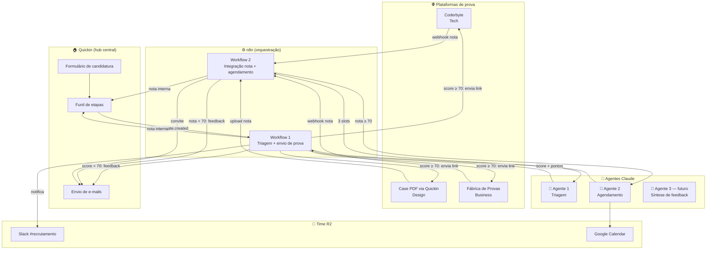

# Arquitetura — CominAI

> O **Quickin é o sistema-fonte da verdade**. Todo o fluxo de candidatura, etapas e dados de candidato vive lá. O CominAI **não substitui o Quickin** — ele é uma camada de inteligência e automação que se conecta ao Quickin via webhooks e API.

---

## 1. Princípios de design

1. **Quickin como hub** — nenhuma cópia paralela de dados. O Copilot lê e escreve no Quickin.
2. **n8n como cola** — toda integração entre Quickin, plataformas de prova, Google Calendar, Slack e os agentes passa por workflows do n8n. Visível, auditável, fácil de evoluir sem deploy.
3. **Agentes Claude focados** — cada agente faz uma coisa bem feita. Sem agentes "generalistas" que viram caixa-preta.
4. **Humano no loop sempre** — o agente recomenda; o recrutador decide. Score é ponto de partida, não veredito.
5. **Logs estruturados** — toda decisão do agente é registrada como nota interna no Quickin para auditoria futura.

---

## 2. Diagrama de alto nível (fluxo completo)

---

## 3. Mapeamento de etapas no Quickin

Mapeamos cada etapa do funil atual do Quickin para a ação que o Copilot dispara:

| Etapa Quickin | Trigger | Ação automática | Output |
|---|---|---|---|
| Nova candidatura | webhook `candidate.created` | Workflow 1 → Agente 1 (Triagem) | Score, recomendação, pontos a investigar gravados como nota interna no Quickin |
| Triagem aprovada (score ≥ corte) | resultado do Agente 1 | Workflow 1 envia link da prova: Coderbyte (Tech) / case PDF via Quickin (Design) / Fábrica de Provas (Business). Slack notificado para acompanhamento. | E-mail enviado, etapa "prova_enviada" no Quickin |
| Triagem reprovada (score < corte) | resultado do Agente 1 | Workflow 1 envia e-mail de feedback automático e move para "Talent Pool" | Status atualizado, candidato notificado |
| Nota da prova recebida | webhook do Coderbyte/Fábrica ou upload do case | Workflow integra a nota ao Quickin como nota interna; se nota ≥ corte, dispara Workflow 2 | Nota integrada, etapa "prova_aprovada" ou "prova_reprovada" |
| Prova aprovada | resultado da integração | Workflow 2 → Agente 2 (Agendamento) | 3 slots de horário, dupla de entrevistadores, e-mail via Quickin (com pontos a investigar do Agente 1 anexados) |
| Entrevista realizada | manual + integração Calendar | — (futuro: Workflow 3) | (futuro: Agente 3 sintetiza feedback) |
| Decisão final | manual pela liderança | — | — |

**Notas de corte (configuráveis por vaga):**
- **Triagem (Agente 1):** padrão 70/100 — abaixo disso, vai para talent pool sem prova
- **Prova:** padrão 70/100 — abaixo disso, e-mail de feedback automático, sem entrevista

---

## 4. Decisões técnicas

### Por que Claude (e não outro LLM)
- Qualidade alta em raciocínio e geração de saída JSON estruturada.
- Janela de contexto larga (até 200k tokens) — comportamento previsível mesmo com CV + LinkedIn longos.
- API confiável e cobrança previsível.
- Já temos chave da Anthropic disponível.

### Por que n8n (e não código Python end-to-end)
- O time de recrutamento entende fluxos visuais — pode editar workflows sem código.
- Conectores prontos para Slack, Google Calendar, HTTP, Webhooks.
- Self-hosted barato e auditável.
- Logs por execução ajudam a debugar.

### Por que PDF (e não scraping de LinkedIn)
- O LinkedIn bloqueia scraping não autorizado (ToS + bloqueio técnico).
- Caminho legal e estável: PDF gerado pela própria função "Save to PDF" do LinkedIn, anexado na candidatura via Quickin.
- Em produção, plugar [Proxycurl](https://nubela.co/proxycurl) (~US$ 0,02 por lookup) elimina o passo manual e dá dados ricos via API oficial.

### Privacidade e LGPD
- Dados sensíveis (CV, e-mail, telefone) ficam no Quickin — sistema já adequado à LGPD.
- O Copilot processa em memória, não persiste em banco próprio.
- Logs do n8n contêm o resultado da triagem (score + texto), nunca senhas ou doc fiscal.
- Direito ao esquecimento: ao deletar candidato no Quickin, nada precisa ser removido de outro lugar.

---

## 5. Vaga de teste (demo do hackathon)

URL: [https://app.quickin.io/#/job/6a03664c57bb6e0013704d27](https://app.quickin.io/#/job/6a03664c57bb6e0013704d27)

Usada como vaga-piloto para demonstrar o workflow ponta-a-ponta no vídeo de apresentação.

---

## 6. O que NÃO está no escopo da v0

- Triagem de vídeo (gravação de candidato) — pode ser Sprint 3+.
- Tradução automática de CV (assumimos PT/EN).
- Anti-fraude (detecção de CV gerado por IA) — Sprint 4.
- Avaliação automática de prova técnica — fora do escopo; quem julga é o Coderbyte/recrutador.
